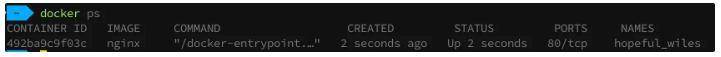
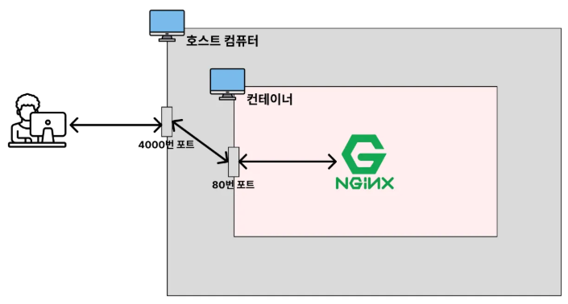
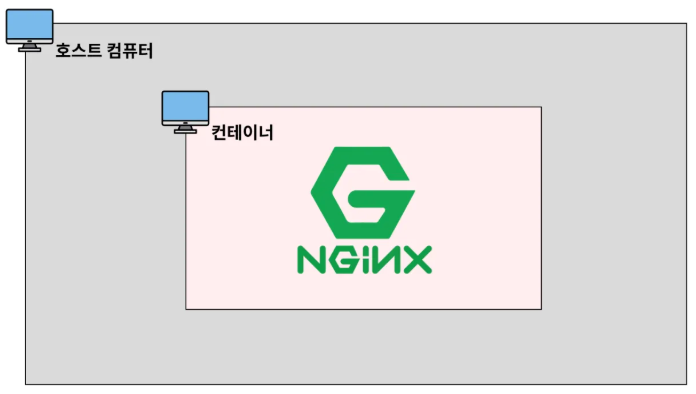

# Docker Container

## 컨테이너 생성 / 실행

### 컨테이너 생성

> 이미지를 바탕으로 컨테이너를 생성함. 이때, 컨테이너를 실행시키지는 않음
>

```bash
docker create nginx // 생성
docker ps -a // 모든 컨테이너 조회
```

<br>

만약에 다음과 같이 명령어를 치면

```bash
docker created mysql
```

→ 이러면 mysql 이미지가 내 컴퓨터에 안깔려 있으면 자동으로 mysql 이미지까지 다운 받아 줌

→ 수동으로 이미지를 다운받지 않아도 됨

<br>

### 컨테이너 실행

> 정지되어 있는 컨테이너를 실행
>

```bash
docker start "컨테이너 명 or 컨테이너 ID"
```

<br>

### 컨테이너 생성+실행(현업에서 자주 씀)

```bash
**docker run "이미지명"**
```

→ 이렇게 실행하면 포그라운드에서 실행됨

→ 실시간으로 보임

- **포그라운드: 내가 실행 시킨 프로그램의 내용이 화면에서 실행되고 출력되는 상태**
- **백그라운드: 내가 실행 시킨 프로그램이 컴퓨터 내부적으로 실행되는 상태**

<br>

백그라운드에서 실행

```bash
docker run -d "이미지명"
```

<br>

### 컨테이너에 이름 붙여서 생성 및 실행하기

```bash
docker run -d --name "컨테이너이름" "이미지명"
ex) docker run -d --name my-web-server nginx
```

<br>

### 호스트의 포트와 컨테이너의 포트를 연결하기


보면 포트가 80번으로 되어있는데 들어가서 보면 접속을 못한다고 함…

<br>

why?


→ 호스트 컴퓨터 안에 컨테이너의 포트와 접근을 할 수 없음

→ 이 둘은 분리되어 있기 때문에 그럼

<br>

따라서 포트를 연결해 줘야함

```bash
docker run -d -p "호스트 포트":"컨테이너 포트" "이미지명"
ex) docker run -d -p 4000:80 nginx
```

→ 이렇게 되면 4000번에서 접속을 하면 가능해짐

<br>

## 컨테이너 조회/중지/삭제


### 실행 중인 컨테이너들만 조회

```bash
docker ps
```

<br>

### 모든 컨테이너들 조회

```bash
docker ps -a
```

<br>

### 컨테이너 중지

```bash
docker stop "컨테이너명 or 컨테이너ID"
docker kill "컨테이너명 or 컨테이너ID"
```

- `kill`: 은 강제 종료

<br>

### 컨테이너 삭제

```bash
docker rm "컨테이너명 or 컨테이너ID"
docker rm -f "컨테이너명 or 컨테이너ID" // 실행되고 있는 특정 컨테이너 삭제
docker rm $(docker ps -qa) // 중지되어 있는 모든 컨테이너 삭제
docker rm -f $(docker ps -qa) // 실행되고 있는 모든 컨테이너 삭제
```
<br>

### 컨테이너 로그 조회

```bash
docker logs "컨테이너ID or 컨테이너명"
```

<br>

최근 로그 10줄만 조회

```bash
docker logs --tail 10 "컨테이너ID"
```

<br>

기존 로그 + 생성되는 로그를 실시간으로 보고싶은 경우

```bash
docker logs -f "컨테이너ID"
```

- `-f`: follow의 약자

<br>

생성되는 로그를 실시간으로 보고싶은 경우

```bash
docker logs --tail 0 -f "컨테이너ID"
```

<br>

## 실행중인 컨테이너 내부 접속하기


```bash
docker exec -it "컨테이너ID" basg
```



호스트 컴퓨터에서는 그냥 들어가서 막 확인할 수 있는데, 컨테이너 안에 들어가서 무엇인가를 하고 싶을 때 내부에 접속함.
