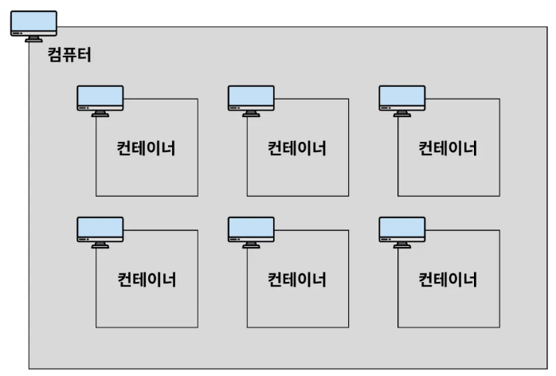

# Docker 기본 개념

## 들어가기전

### Well-known port

- `22번`: SSH, 원격 접속을 위한 포트 번호
- `80번`: HTTP, HTTP로 통신을 할 때 사용
- `443번`: HTTPS, HTTPS로 통신할 때 사용

 

## Docker란?

> **컨테이너를 사용하여 각각의 프로그램을 분리된 환경에서 실행 및 관리할 수 있는 기술**
>

 

## Container란?

> **하나의 컴퓨터 환경 내에서 독립적인 컴퓨터 환경을 구성해, 각 환경에 프로그램을 별도로 설치할 수 있게 만든 개념**
>

→ 컴퓨터 속의 미니 컴퓨터 느낌

 

- 여기서 제일 위의 컴퓨터 = **host 컴퓨터**

 

컨테이너의 특징

- 독립적임
    - 각자의 디스크(저장 공간)를 가지고 있음
    - 각자의 네트워크를 가지고 있음

 

## 이미지란?

> 닌텐도 게임 칩이라고 생각하면 쉬움.
**프로그램을 실행하는 데 필요한 설치 과정, 버전 정보 등을 포함하고 있음. 즉, 프로그램을 실행하는 데 필요한 모든 것을 포함하고 있음**
>
